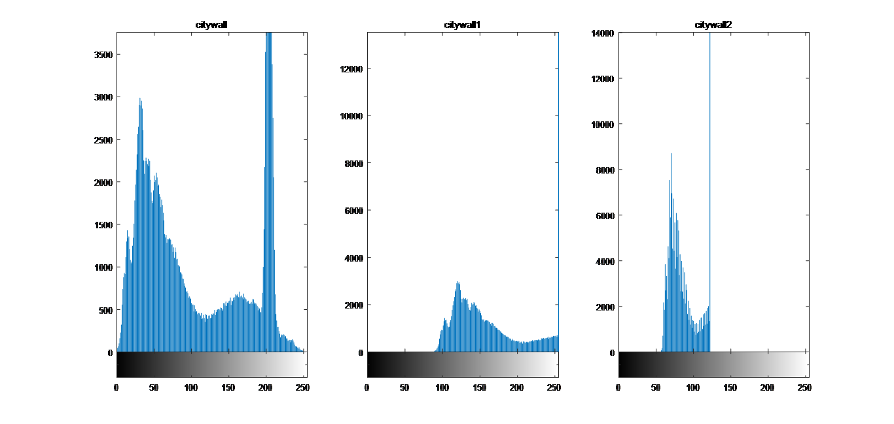
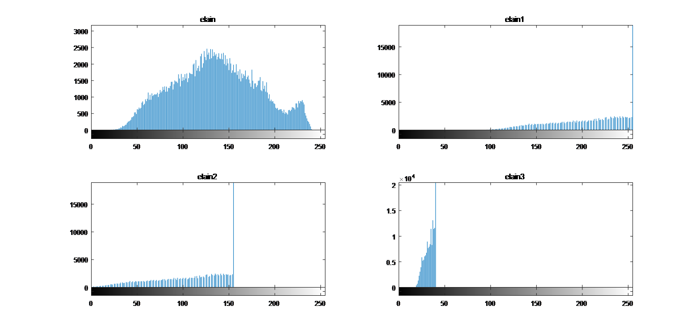
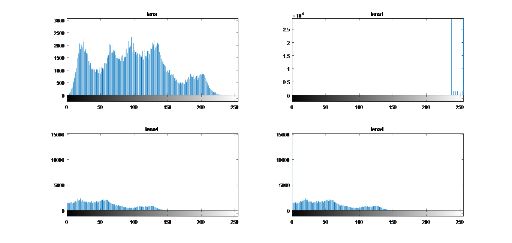
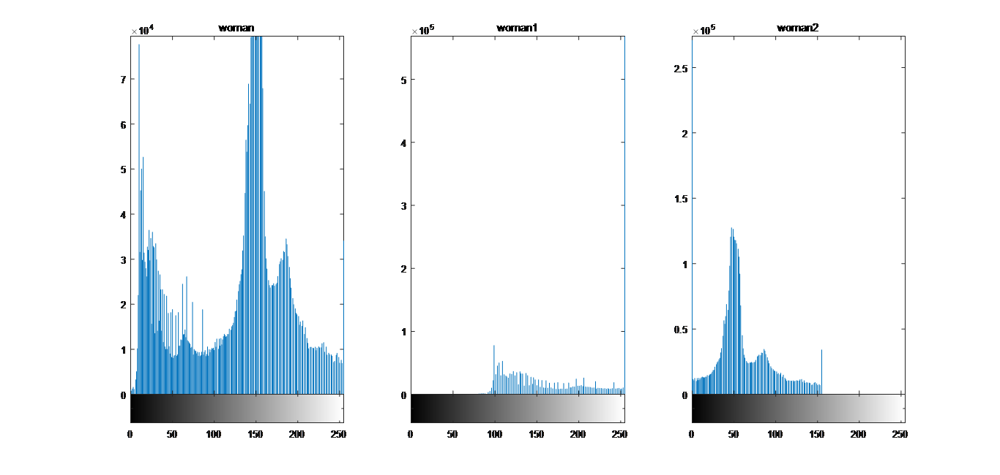
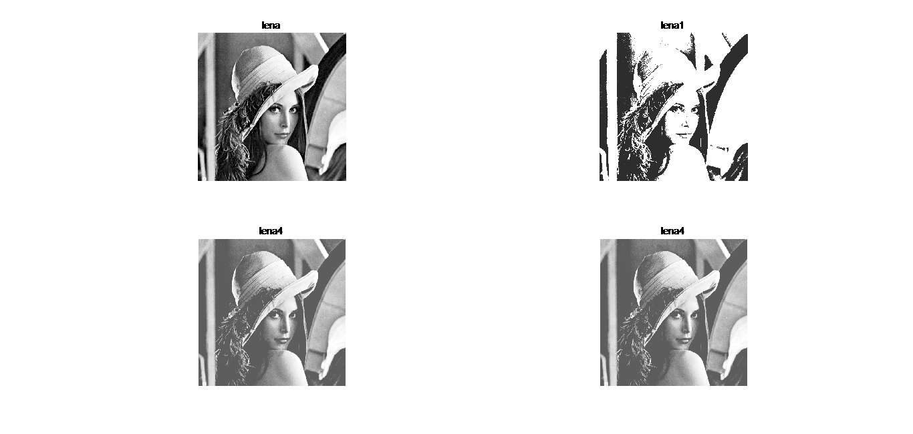
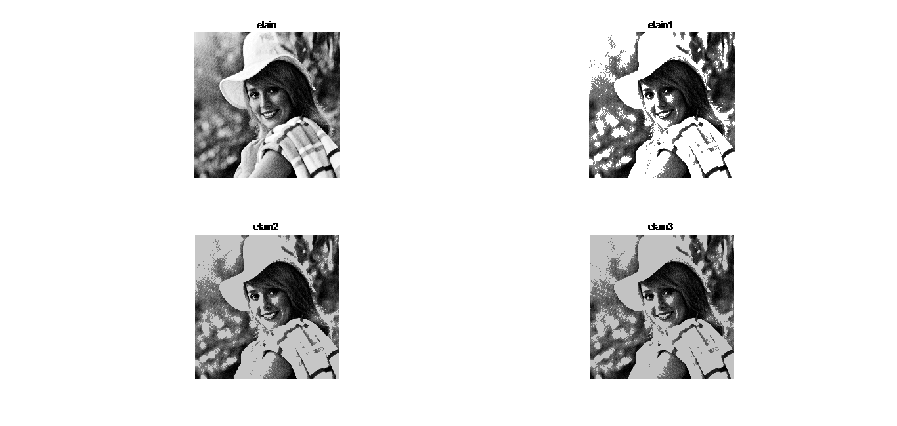
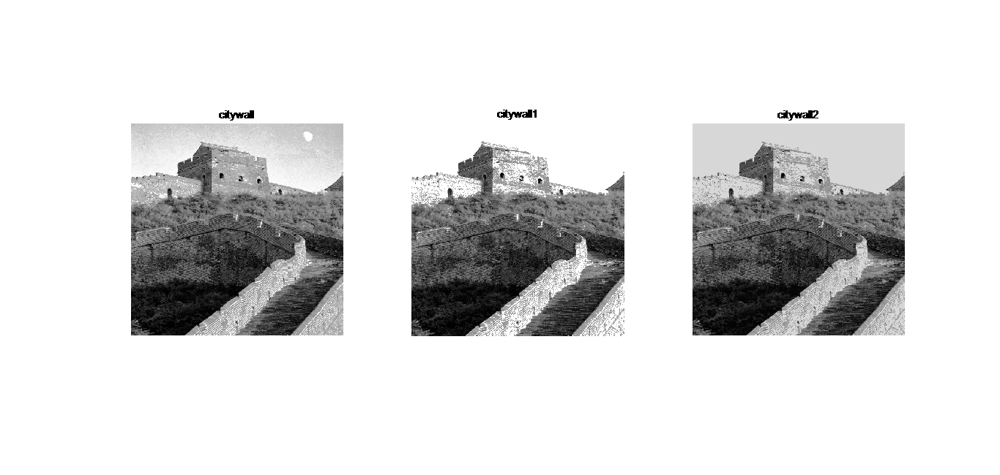
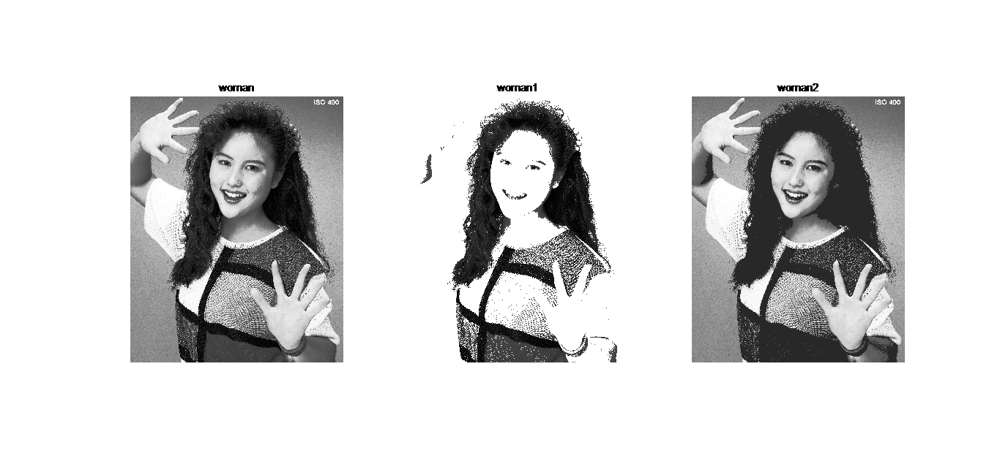
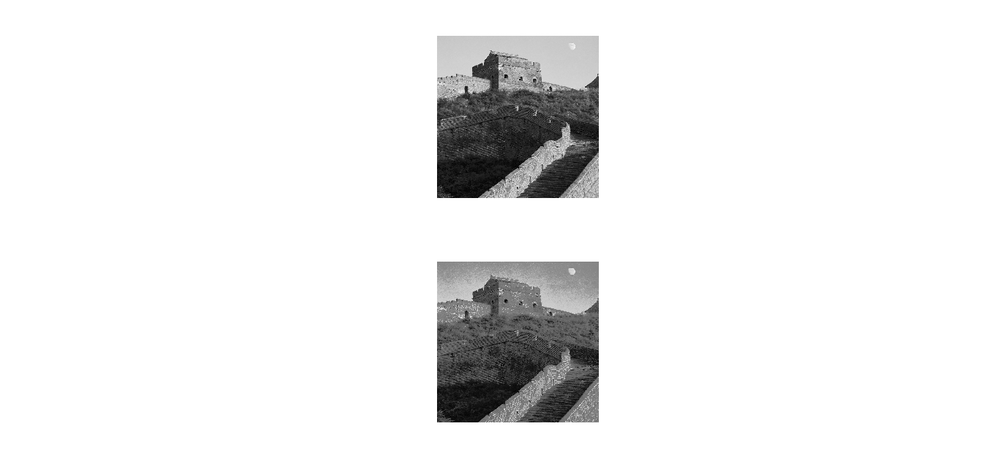
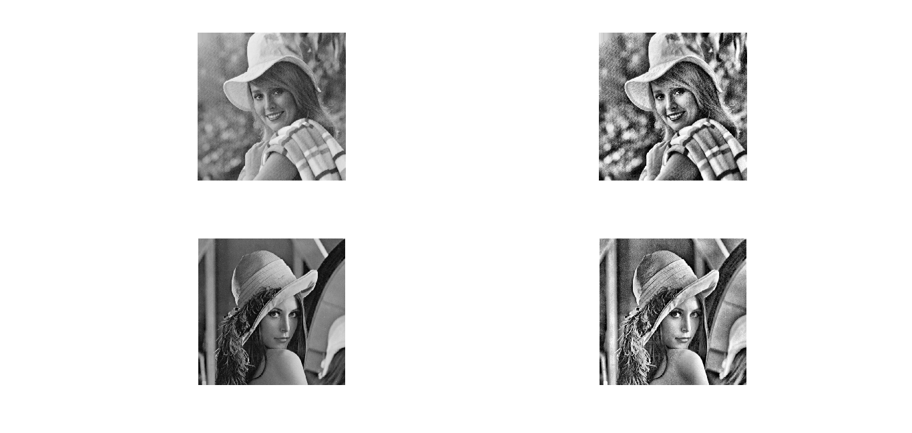

数字图像处理实验报告

自动化64               2160504103           魏慎行

摘要
灰度直方图是数字图像处理中最简单且有效的工具，他是多种空域处理的基础。本文使用MATLAB，实现灰度直方图的绘制、直方图均衡直方图匹配、直方图分割等操作，并在此基础上比对不同对比度图片的处理结果进行比较，分析各操作的优缺点。

1、	直方图绘制
使用imread命令将直方图读入MATLAB工作区，然后使用imhist命令绘制出灰度直方图。但是调整后的图像无法正常读入，使用iminfo命令查询后得知是索引图，所以使用imread指令时还要得到图像map的值，然后使用ind2gray函数将其转化为灰度图。之后即可正常将图画出。

2、	直方图均衡
在MATLAB中使用histeq函数对图像进行直方图均衡然输出图片对比。由图像结果可以看出，对于对比度适中的图像，直方图均衡没有特别明显的效果。对于对比图特别小的图像，效果特别明显，本来偏亮或偏暗的图像，经过直方图均衡后均衡后细节大大加强，图像细节明显高于原图像。对比度特别大的二值图像，也几乎没有什么效果。

3、	直方图匹配
在MATLAB中使用histeq命令并指定直方图可以进行直方图规定化处理。下图为将citywall按照lena的直方图进行匹配的结果。

4、	局部直方图增强
在MATLAB中使用adapthisteq(pic,'NumTiles',[7,7])函数可以指定局部增强的方块大小进行局部增强。下图为7*7增强后的结果。由图像可以看出，局部增强后，对于一些细节更加清晰。

5、	直方图图像分割
在MATLAB中，使用函数graythresh可以选择合适的阈值对图像进行二值化处理，然后使用im2BW函数将图像二值化，即高于阈值部分变为1，低于阈值为0。从图像来看，基本将图像的边沿分割出来。

